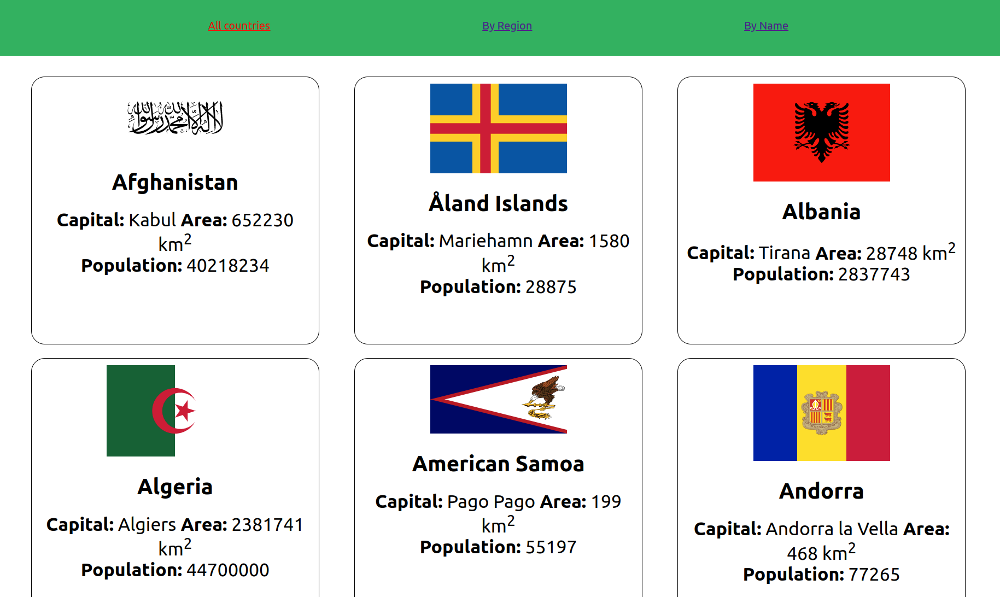
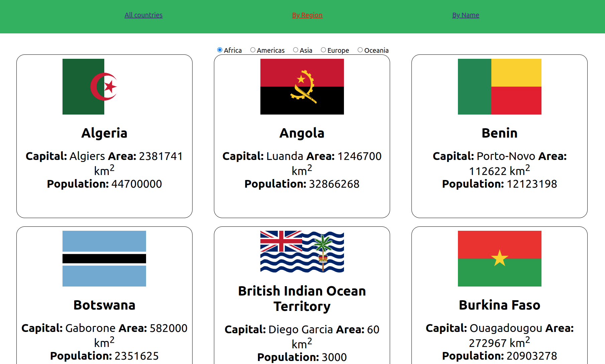
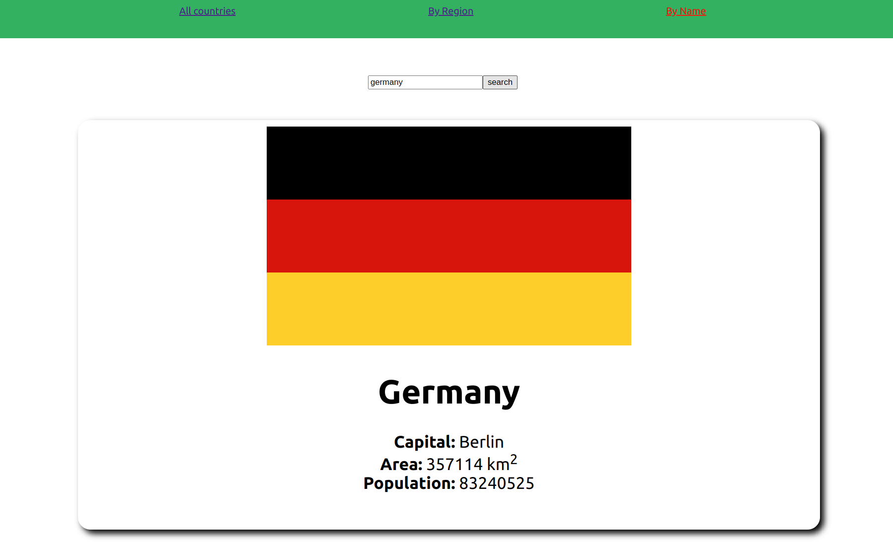

# SPA-countries-app

## preparation:
- clone the repo
- install the dependencies: npm i

## tasks:

1) In App.js, route to the pages components you find in folder `views` using react-router-dom.
2) in AllCountries component:
- fetch all the countries on load (which hook do we use for this?) from restcountries using this URL https://restcountries.com/v2/all

- save the received array of countries in a local state {countries}

- show each country in the array {countries} using the template component CountryCard

3) in ByRegion component, you find a local state called {region} already exists with an initial value:
- fetch the countries by region on load (which hook do we use for this?) and make sure it gets executed every time the state {region} changes (what should you add to that hook?) using this URL https://restcountries.com/v2/region/{region} 

- save the received array of countries in a local state {countries}

- show each country in the array {countries} using the template component CountryCard

- add a change event to the radio inputs to save their values in the state {region} when they change.

4) in ByName component:
- save the user input in a local state then use it to fetch a country by name onSubmit using this URL https://restcountries.com/v2/name/{name}

- save the received object of the searched country in a local state {country} then show it using the component SearchResult

First Page:

Second Page:

Third Page:
